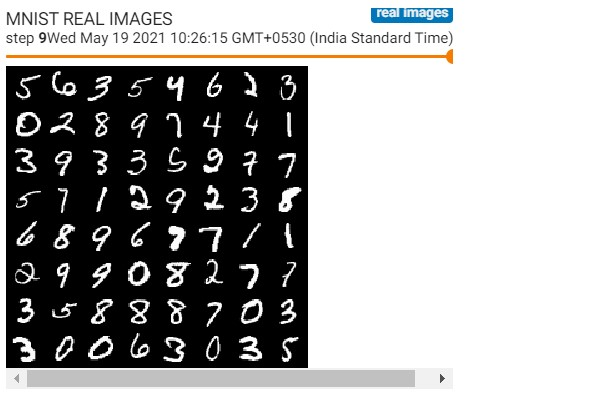
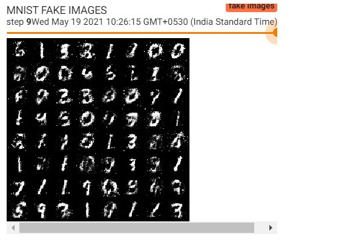

# SimpleGAN
This is an introductory &amp; comprehensible re-implementation of the infamous __Generative Adversarial Network__ (Goodfellow et al.) [paper](https://arxiv.org/abs/1406.2661) which consists of a GAN trained on MNIST images and has been coded using the PyTorch framework.

This is meant to be a beginner-friendly, working GAN model which can generate handwritten digits(1-10) and is visualized using TensorBoard. The results, upon successful completion of the project, will be displayed below.

## Intuition
The Generative Adversarial Network consists of 2 models namely, the generative and discriminative models which are Deep Neural Networks. The generative and discriminative models compete against each other in the same environment where, one (generative model) works to generate fake data and the other (discriminative model) tries to differentiate between the fake and original data.

The objective of the discriminative model is to maximize the probability of assigning accurate labels to data samples as to whether they originated from the actual dataset or have been generated by the generative model.
The objective of the generative model is to minimize the probability of the discriminator identifying real data i.e. to produce spitting replicas of the images in the original dataset.
This is done simultaneously and iteratively in order to pit both models against each other to improve performance.

## Implementation
The objective is that the generator should ideally be able to mimic original data and produce replicas in such a manner that the discriminator can't possibly identify variations.

- The models were successfully built with Linear layers, LeakyReLU activations and dropout.
- The dataset has been loaded into a separate folder for ease of access.
- Loss used - Binary CrossEntropy with Logits (inclusion of a sigmoid layer)
- The training was complete and also employed automatic mixed precision training available via torch.cuda.amp for faster training as it converts certain appropriate tensors to FP16 precision.
- This entire process will provide satisfying results only when trained for certain number of epochs. The MNIST GAN is trained for 20 epochs with visualizations of the training process obtained from TensorBoard, attached in the 'Results' section below.

## Results
The trained models have been saved as files under the models folder. Epochs 0-19 represent the entire training process complete with inclusion of the loss values. The process was visualized using TensorBoard (until step 9) and the relevant results have been included below:

Real images generated by SimpleGAN  |  Fake images generated by SimpleGAN
----------------------------------  |  ----------------------------------
 |  

Final loss for Discriminator:  0.4623
Final loss for Generator:  1.5128

Hence the Generative Adversarial Network has been reimplemented successfully.

## Contributor
<td width:25%>

Pooja Ravi

</td>

## License
MIT © Pooja Ravi

This project is licensed under the MIT License - see the [License](LICENSE) file for details

